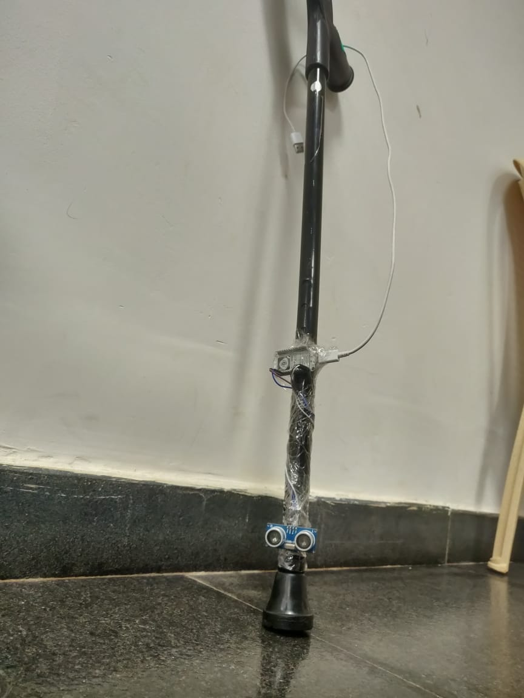
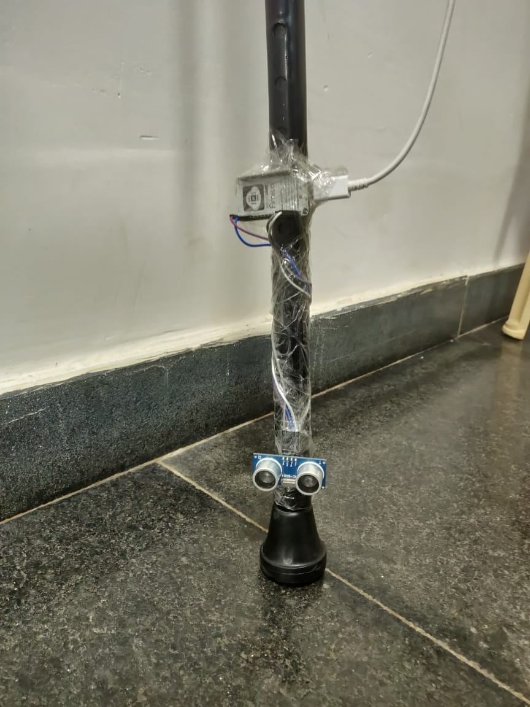
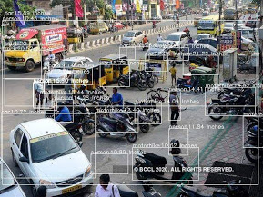
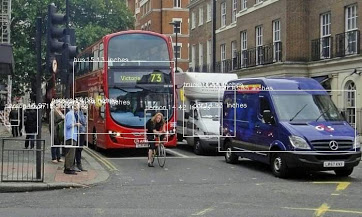
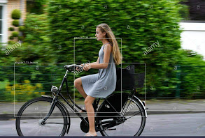
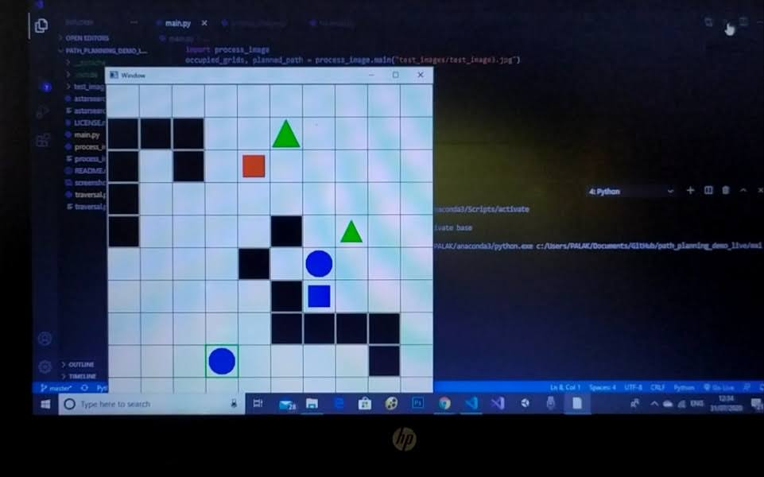

# Smart_cane

## Introduction

Think if you were a blind man, how difficult it would be for you to walk. Even if you use white cane there might be chances that you could fall or your cane gets stuck somewhere.
What exist in the world of visually impaired people ? Just obstacles and path.
This project revolves around helping blind people to have a real view of the outside world and avoid unknown obstacles.

## Problem Statement

Visually impaired people can’t see the real view of outside world.
Even with the help of white cane there are chances to fall.
They cannot pre-plan their path.
Can’t detect the objects which are far away.
Fear to walk on roads.

## Solution

We are going to build a smart cane for visually impaired people.
This cane will give a real view of outside world to these people by detecting what’s around them.
Using speech recognition it’ll tell the person that what all things are around them.
It’ll also calculate the distance of each object which will help them to have a smooth walk anywhere without fear.
This will create a world like us for them and no longer in there life will exist just obstacles and paths but things which they never saw.

## Theme 

Our overall project comes under three themes :

           - AI
           - Healthcare                  

## Tech Stack

- Artificial intelligence
- Internet of things
- Text to speech recognition
- Computer vision

## Working 

The camera fitted in the cane will capture each frame and will detect the object using a pre-trained AI model (YOLOv4)
It’s also fitted with a ultrasonic sensor which will help in measuring a precise distance of the object from that person.
After processing all these things speech recognition module will tell that person about the detected objects and their distance.
It’ll also use planning algorithm to suggest them the correct path.

## Overview

## Object Detection

## Path planning 

